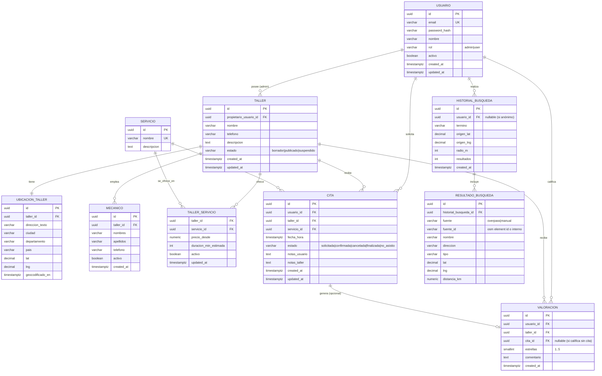

## Diagrama Entidad–Relación (DER)

### Alcance real del repositorio (lo que existe hoy)

En el código actual **no existe capa de persistencia**:

- No hay entidades JPA (`@Entity` / `@Table`) ni repositorios Spring Data reales.
- No hay migraciones (`Flyway`/`Liquibase`) ni `schema.sql`.
- El backend devuelve una lista “mock” de `Taller`.
- El frontend modela funcionalmente: **login por rol (admin/user)**, **taller**, **búsqueda por ubicación** (Nominatim/Overpass, o talleres estáticos), **citas**, **valoraciones**, **historial de búsquedas**.

Este DER es el **modelo de datos propuesto** para soportar todas esas vistas y escalar a producción.

### DER (Mermaid)

### Notas de escalabilidad (resumen)

- **IDs**: `uuid` para evitar colisiones y facilitar particionado/replicación.
- **Geoespacial**: en producción, ideal `PostgreSQL + PostGIS` (index GIST/BRIN) para búsquedas cercanas.
- **Separar “catálogo” vs “externo”**: `RESULTADO_BUSQUEDA` permite guardar resultados de Overpass sin convertirlos en “talleres propios”.
- **Normalización**: `MECANICO` y `SERVICIO` evitan meter listas en un string (como el campo `Mecanicos` actual).

